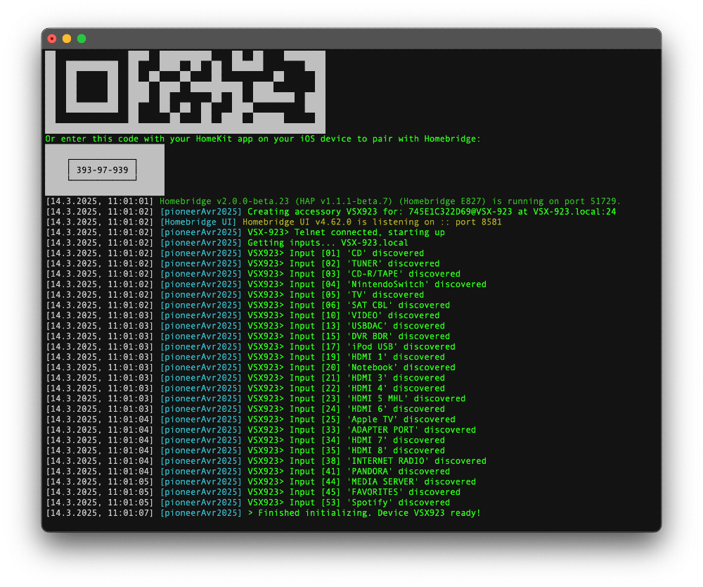

# homebridge-pioneer-avr-2025

A [Homebridge](https://github.com/nfarina/homebridge) plugin that integrates your Pioneer AVR as a TV accessory in HomeKit. This project supports Node.js versions up to 22 and is compatible with Homebridge version 2 and earlier. Developed in TypeScript and as a Platform, it incorporates modern Homebridge practices and methods to provide a seamless setup process with optional manual configuration. With automatic receiver detection, the plugin enhances reliability and user-friendliness.

While the plugin is not perfect, I hope it provides a dependable way to connect your receiver to HomeKit.

> **Note**: This plugin is specifically designed for Pioneer models released before 2017 that use Pioneer Telnet Commands (e.g., VSX-922, VSX-527). It may not be compatible with newer models that use the ISCP protocol (e.g., VSX-LX304). For newer models, please consider using the [homebridge-onkyo-pioneer](https://github.com/nitaybz/homebridge-onkyo-pioneer) plugin or see the "Alternatives" section below.

   
<br><br>
Issues or Feedback: [Github homebridge-pioneer-avr-2025](https://github.com/holuspokus/homebridge-pioneer-avr-2025/issues)
<br>

## Features
This plugin allows you to control various aspects of your Pioneer AVR directly from your Home app, including:

* Power On/Off control
* Input selection with ease
* Volume adjustment (presented as a Lightbulb control in the Home app)
* Customizing the visibility of inputs
* Renaming inputs for easier identification
* Remote control functionality on iOS devices
* Using the iOS Remote's "Play/Pause" button or a HomeKit-Switch to toggle between EXTENDED STEREO and PRO LOGIC 2 MOVIE modes (configurable)
* Automatic input discovery for seamless setup
* Automatic receiver discovery for effortless integration
* Easily switch between inputs using HomeKit switches for direct control and enhanced automation capabilities
<br>
<br>

## Installation
1. **Install Homebridge**: Follow the [Homebridge Installation Guide](https://github.com/homebridge/homebridge/wiki).
2. **Install the Plugin**: Use the Homebridge Web Interface (Config-UI) to install **homebridge-pioneer-avr-2025**.
3. **Connect to HomeKit**: Open the Home app on your iOS device, tap Add Accessory, and scan the QR code displayed in the Homebridge Web Interface (Config-UI).

## Accessory Configuration
The receiver is detected automatically over the network.  
You may also configure settings via the Config-UI interface.  
Manual configuration is also available.

### Adding Input Switches
Once the receiver's inputs are loaded, you can select up to five inputs through the plugin settings in Config-UI. These selected inputs will appear in HomeKit as individual switches, allowing direct selection, use in automations, or integration with physical switches.  

If the receiver is already on and the input is selected, pressing the switch again will turn off the receiver. This behavior is particularly useful in HomeKit, where only one scene can be assigned to a button—not two separate scenes (e.g., one for turning on and another for turning off). With this feature, the same button can be used to turn on the receiver, switch input, and turn off the receiver.  

The button can also serve as a trigger for other scenes but should not be included in the same scene with other devices (such as lights) to avoid unintended behavior.

**Configuration Option**  
Additionally, you can control this behavior via the plugin's configuration option **Toggle Off If Already Active**. When enabled (default), if the receiver is already on and the same input switch is pressed again, the receiver will be turned off. This allows a single button to handle turning the receiver on, switching inputs, and turning it off. If disabled, pressing the active switch will leave the receiver on and simply reselect the same input without turning off the receiver.

#### Toggle Listening Mode Options
When `toggleListeningMode` is enabled, this option adds a dedicated switch in HomeKit that lets you alternate between two predefined listening modes on your receiver with a single button press. Activating the switch toggles the receiver from the primary mode to the secondary mode and vice versa, providing an efficient way to manage your audio settings. Although the button can also trigger other scenes, it is best used exclusively for switching listening modes to avoid conflicts with other HomeKit accessories.
<br>

### Preparing the Receiver and Network
To ensure proper connectivity for the plugin, connect the receiver to the network. The simplest way to verify that the receiver is accessible is to check if an iPhone can establish an AirPlay connection to the receiver. If this works, the receiver is ready. Otherwise, ensure the following:

1. **Ensure Network Compatibility**  
   The receiver and Homebridge server must be connected to the same network and subnet to enable compatibility with Bonjour/Multicast discovery. This configuration is typically standard for home networks.

2. **Enable DHCP and DNS**  
   For local hostname resolution (e.g., `vsx-922.local`), configure the Homebridge server to use DHCP and ensure the router is set as the DNS server. This allows proper name resolution for devices on the local network without requiring manual IP entries.

3. **Set Up the Receiver’s Network**  
   If the router lacks a built-in DHCP server, you will need to configure the receiver’s network settings manually.

4. **Enable “Network Standby”**  
   Enable “Network Standby” in the receiver’s network settings to ensure it remains accessible on the network, even when not actively in use. Refer to the receiver’s manual for specific instructions.

After confirming the network connection, restart the plugin to enable communication with the receiver.
<br><br>

## Manual Installation
1. **Install the Homebridge framework:**
   ```bash
   npm install -g homebridge
   ```

2. **Update your configuration file:**  
   Use the example below or check `sample-config.json` in this repository for a sample. Create or edit the `config.json` file in the Homebridge directory (typically `~/.homebridge/` or `/var/lib/homebridge/`) with the appropriate configuration for your Pioneer AVR.

3. **Install homebridge-pioneer-avr-2025:**
   ```bash
   sudo hb-service add homebridge-pioneer-avr-2025
      or
   npm install -g homebridge-pioneer-avr-2025
   ```

4. **Start Homebridge:**
   ```bash
   sudo hb-service restart
      or
   homebridge
   ```

   

5. **Connect to HomeKit**  
   **Retrieve the Setup Code:**  
   Run the following command to view the Homebridge logs, which include the setup code:
    ```bash
    sudo hb-service logs
    ```
   Look for output similar to:
    ```
    Enter this code with your HomeKit app on your iOS device to pair with Homebridge:

        ┌────────────┐     
        │ 340-36-041 │     
        └────────────┘     
    ```

### Add Childbridge to HomeKit
- Open the **Home app** on your iOS device.
- Tap **"Add Accessory"**.
- Choose **"Don't Have a Code or Can't Scan?"**.
- Select **"Enter Code"** and input the 8-digit code (e.g. `340-36-041`) displayed in the logs.
<br>
<table>
  <tr>
    <td></td>
    <td></td>
    <td></td>
  </tr>
</table>

<br>

|  |  |  |


### Accessory Configuration Example
Below is a sample configuration for your accessory:

#### Minimalistic Setup with Discovery
For most users, the following minimal configuration is recommended. The plugin will automatically discover your receiver and configure it for use:
```json
"platforms": [
    {
        "platform": "pioneerAvr2025",
        "name": "pioneerAvr2025"
    }
]
```
This setup simplifies installation and leverages the plugin's automatic discovery feature, ensuring ease of use and reliable integration.  

#### Minimalistic Setup with Manual Configured Receiver
```json
"platforms": [
    {
        "platform": "pioneerAvr2025",
        "name": "pioneerAvr2025",
        "host": "VSX-922.local",
        "port": 23,
        "maxVolume": 65,
        "minVolume": 30,
        "toggleOffIfActive": true,
        "toggleListeningMode": true
    }
]
```

|                Key               | Value                                                      |
| -------------------------------: | :--------------------------------------------------------- |
|           platform               | don't change                                               |
|               name               | Custom input, can remain                                   |
|               host               | needs to be accurate or empty                              |
|               port               | needs to be accurate                                       |
|          maxVolume               | Optional input, can remain                                 |
|          minVolume               | Optional input, can remain                                 |
|          telnetSwitch            | Optional input, can remain
|      toggleOffIfActive           | Toggle receiver off if active                              |
|      toggleListeningMode         | If enabled, the listening mode toggle is shown in HomeKit.   |
|      toggleListeningModeLink     | Controls the display of the listening mode toggle: bundled in receiver view (enabled) or as a separate switch (disabled). |

> - **toggleListeningMode**, when enabled (default) the HomeKit receiver will display a switch to toggle between two predefined listening modes. If disabled, the switch will not appear.  
> - **toggleListeningModeLink**, when enabled (default) the toggle is displayed directly in the receiver view when devices are bundled. If disabled, it will appear as a separate switch, regardless of the bundling setting.

> **host:**  
> To use the network scan (Multicast), leave the `host` field empty in the plugin configuration.

> **port:**  
> The port used for Telnet to connect to your receiver.  
> If port 23 does not work, try port 8102.  
> Alternatively, enable Web Interface (see user manual) and then try opening in your web browser something like:
> `http://vsx-922.local/1000/port_number.asp` or  
> `http://192.168.178.99/1000/port_number.asp`  
> to find the correct port.

> **maxVolume:**  
> A number between 0 and 100; for example, 60 means 60% of the max volume.  
> 100 = -0dB (i.e., 185 = No Limit),  
> 60 = -16dB,  
> 0: disables the volume as brightness feature  
> Defaults to 80 if undefined.  
> A value of 60 has worked well for me.  

> **Note:** The difference between `maxVolume` and `minVolume` should be at least 20.  
> Both only affects the volume as a brightness feature, not the remote.

> **minVolume:**  
> A number between 0 and 100; for example, 30 means 30% of the max volume.  
> Defaults to 20 if undefined.  
> This setting is only active in combination with `maxVolume`.  
> A value of 35 has worked well for me.  

> **listeningMode:**
> The default listening mode when the switch in HomeKit is active. Default 0013 PRO LOGIC2 MOVIE   

> **listeningModeOther:**
> The alternative listening mode that is toggled via HomeKit switch or the iOS Remote app. Default 0112 EXTENDED STEREO   

> **listeningModeFallback:**
> A backup listening mode used when the Primary Listening Mode is unavailable (e.g., due to input signal restrictions). This mode should be **different** from the Primary Listening Mode and should be chosen based on what is likely to be supported. Default 0101 ACTION\nAvailable modes can be found in the list at the bottom of this page.   

> **inputSwitches:**
> Set up to 5 inputs to expose as switches in HomeKit   

> **toggleOffIfActive:**
> If enabled, pressing an input switch that is already active will turn off the receiver.
> This allows a single button to toggle the receiver on and off, facilitating one-button control in HomeKit.
> If disabled, the receiver will remain on and simply reselect the current input.

> **toggleListeningMode:**  
> If enabled, the HomeKit receiver will display a switch that allows you to toggle between two predefined listening modes. If disabled, the switch will not be available in HomeKit.

> **toggleListeningModeLink:**  
> This option controls how the listening mode toggle switch is displayed when devices are bundled. If enabled (default), the toggle appears directly within the receiver’s view when devices are grouped. If disabled, the toggle is presented as a separate switch, independent of the bundling setting.

> **maxReconnectAttempts:**  
> Set the total number of reconnect attempts before giving up on reconnecting to the device.

> **maxReconnectAttemptsBeforeDiscover:**  
> Set the maximum number of reconnect attempts before triggering a device rediscovery process.

> **sendKeepAliveTimeoutMinutes:**  
> Set the send keep alive timeout in minutes. This value determines how long after a user interaction the keepalive should be sent to maintain the connection. The timeout is clamped between 5 minutes and two weeks, with a default of 48 hours (2880 minutes).  
> Examples:  
> - 4 hours: 240 minutes  
> - 2 days: 2880 minutes  
> - 8 days: 11520 minutes  
> - 14 days: 20160 minutes  
>
> Short Keepalive Duration:  
> - **Advantages:**  
>   - The keepalive is sent for a shorter period after user interaction, allowing the receiver to enter sleep mode sooner, which may reduce power consumption.  
> - **Disadvantages:**  
>   - If the keepalive stops too soon, the connection may close before the next user interaction, causing a delay when the plugin needs to re-establish communication.  
>   - The receiver's state (e.g., volume or input changes made directly on the device) may not be reflected in the plugin if the connection is lost too early.  
>  
> Long Keepalive Duration:  
> - **Advantages:**  
>   - The plugin maintains the connection for a longer period after user interaction, ensuring a quick response and that all changes made directly on the receiver (e.g., volume or input adjustments) are reflected in HomeKit.  
>   - Reduces the need for frequent reconnections, resulting in a smoother user experience.  
> - **Disadvantages:**  
>   - A longer keepalive duration may prevent the receiver from entering sleep mode, leading to increased power consumption.  

> **telnetSwitch:**  
> Enables control of the Telnet connection to the receiver via a HomeKit switch. This is a global setting that applies to all receivers.  
> The switch executes its command only after a 60-second delay following the last user interaction and only when the receiver is off; if the delay hasn't been met, it simply waits until the full 60 seconds have passed before acting. Once pressed, the switch can revert to its original state until the action is effectively executed. No worries - these timeouts are deliberately in place to prevent constant reconnecting.  
> It is especially useful for HomeKit automation (e.g., in combination with geofencing or time-based control), since establishing a connection with the receiver takes approximately 10 - 20 seconds when the plugin is not already connected.  
> The connection stays active as long as the receiver is on. However, if the receiver is off and the sendKeepAliveTimeoutMinutes period expires, the connection is terminated until a new user interaction via HomeKit occurs.

> **name:**
> In the example below, "name" under "devices" refers to the name as it appears in HomeKit.
> Characters that could cause issues are automatically removed.

#### Over-the-top unrealistic setup with manual configured Receivers
```json
"platforms": [
    {
        "platform": "pioneerAvr2025",
        "name": "pioneerAvr2025",
        "devices": [
            {
                "host": "VSX-922.local",
                "port": 23,
                "name": "VSX922",
                "listeningMode": "0013",
                "listeningModeOther": "0112",
                "listeningModeFallback": "0101",
                "inputSwitches": [
                    "20",
                    "25",
                    "01",
                    "04"
                ]
            },
            {
                "ip": "196.168.1.2",
                "port": 23,
                "name": "VSX923",
                "maxVolume": 75,
                "minVolume": 20
            },
            {
                "ip": "196.168.3.19",
                "port": 8102,
                "name": "VSX924",
                "maxVolume": 100,
                "minVolume": 20,
                "inputSwitches": [
                    "02",
                    "03",
                    "04",
                    "05",
                    "25"
                ]
            },
            {
                "ip": "VSX-1120.local",
                "port": 24,
                "name": "VSX1120"
            }
        ],
        "maxVolume": 65,
        "minVolume": 30,
        "toggleOffIfActive": true,
        "toggleListeningMode": true,
        "toggleListeningModeLink": true,
        "maxReconnectAttempts": 1000,
        "maxReconnectAttemptsBeforeDiscover": 10,
        "telnetSwitch": true,
        "sendKeepAliveTimeoutMinutes": 20160,
        "_bridge": {
            "username": "0E:D6:86:BA:AM:69",
            "port": 35337
        }
    }
]
```

#### Minimalistic Setup After Discovery
Set input switches for discovered devices:
```json
"platforms": [
    {
        "platform": "pioneerAvr2025",
        "name": "pioneerAvr2025",
        "discoveredDevices": [
            {
                "host": "VSX-922.local",
                "inputSwitches": [
                    "20",
                    "25",
                    "01",
                    "04"
                ]
            }
        ]
    }
]
```

> **Note:**  
> The "discoveredDevices" section is automatically created when a receiver is detected. There is no need to manually add devices to this section, as it is intended for configuring additional attributes for automatically discovered devices. Attributes such as `maxVolume`, `minVolume`, `inputSwitches`, `toggleListeningMode`, and `toggleListeningModeLink` can be customized here for enhanced control. The `host` attribute serves as a key and should not be modified.

<br>

#### Known Listening Modes
| Code  | Description                                     |
| ----- | ----------------------------------------------- |
| 0001  | STEREO (cyclic)                                 |
| 0009  | STEREO (direct set) (set to SCI-FI mode.)         |
| 0151  | Auto Level Control (A.L.C.)                     |
| 0003  | Front Stage Surround Advance Focus            |
| 0004  | Front Stage Surround Advance Wide (set to PURE DIRECT) |
| 0153  | RETRIEVER AIR |
| 0010  | STANDARD mode. |
| 0011  | (2ch source) |
| 0013  | PRO LOGIC2 MOVIE |
| 0018  | PRO LOGIC2x MOVIE |
| 0014  | PRO LOGIC2 MUSIC |
| 0019  | PRO LOGIC2x MUSIC |
| 0015  | PRO LOGIC2 GAME |
| 0020  | PRO LOGIC2x GAME |
| 0032  | WIDE SURROUND MOVIE |
| 0033  | WIDE SURROUND MUSIC |
| 0012  | PRO LOGIC |
| 0016  | Neo:6 CINEMA |
| 0017  | Neo:6 MUSIC |
| 0028  | XM HD SURROUND |
| 0029  | NEURAL SURROUND |
| 0024  | (Multi ch source)+PRO LOGIC2x MUSIC |
| 0034  | (Multi-ch Source)+PRO LOGIC2z HEIGHT |
| 0035  | (Multi-ch Source)+WIDE SURROUND MOVIE |
| 0036  | (Multi-ch Source)+WIDE SURROUND MUSIC |
| 0025  | DTS-ES Neo:6 |
| 0026  | DTS-ES matrix |
| 0027  | DTS-ES discrete |
| 0101  | ACTION |
| 0103  | DRAMA |
| 0102  | SCI-FI |
| 0105  | MONO FILM |
| 0104  | ENTERTAINMENT SHOW |
| 0106  | EXPANDED THEATER |
| 0116  | TV SURROUND |
| 0118  | ADVANCED GAME |
| 0117  | SPORTS |
| 0107  | CLASSICAL |
| 0110  | ROCK/POP |
| 0109  | UNPLUGGED |
| 0112  | EXTENDED STEREO |
| 0113  | PHONES SURROUND |
| 0051  | PROLOGIC + THX CINEMA |
| 0052  | PL2 MOVIE + THX CINEMA |
| 0053  | Neo:6 CINEMA + THX CINEMA |
| 0054  | PL2x MOVIE + THX CINEMA |
| 0092  | PL2z HEIGHT + THX CINEMA |
| 0055  | THX SELECT2 GAMES |
| 0093  | PL2z HEIGHT + THX MUSIC |
| 0073  | Neo:6 MUSIC + THX MUSIC |
| 0074  | PL2 GAME + THX GAMES |
| 0075  | PL2x GAME + THX GAMES |
| 0094  | PL2z HEIGHT + THX GAMES |
| 0076  | THX ULTRA2 GAMES |
| 0077  | PROLOGIC + THX MUSIC |
| 0057  | THX SURROUND EX (for multi ch) |
| 0058  | PL2x MOVIE + THX CINEMA (for multi ch) |
| 0095  | PL2z HEIGHT + THX CINEMA (for multi ch) |
| 0067  | ES 8ch DISCRETE + THX CINEMA (for multi ch) |
| 0031  | PRO LOGIC2z Height |
| 0100  | ADVANCED SURROUND (cyclic) |
| 0050  | THX (cyclic) |
| 0068  | THX CINEMA (for 2ch) |
| 0069  | THX MUSIC (for 2ch) |
| 0070  | THX GAMES (for 2ch) |
| 0071  | PL2 MUSIC + THX MUSIC |
| 0072  | PL2x MUSIC + THX MUSIC |
| 0078  | PROLOGIC + THX GAMES |
| 0056  | THX CINEMA (for multi ch) |
| 0059  | ES Neo:6 + THX CINEMA (for multi ch) |
| 0060  | ES MATRIX + THX CINEMA (for multi ch) |
| 0061  | ES DISCRETE + THX CINEMA (for multi ch) |
| 0062  | THX SELECT2 CINEMA (for multi ch) |
| 0063  | THX SELECT2 MUSIC (for multi ch) |
| 0064  | THX SELECT2 GAMES (for multi ch) |
| 0065  | THX ULTRA2 CINEMA (for multi ch) |
| 0066  | THX ULTRA2 MUSIC (for multi ch) |
| 0079  | THX ULTRA2 GAMES (for multi ch) |
| 0080  | THX MUSIC (for multi ch) |
| 0081  | THX GAMES (for multi ch) |
| 0082  | PL2x MUSIC + THX MUSIC (for multi ch) |
| 0096  | PL2z HEIGHT + THX MUSIC (for multi ch) |
| 0083  | EX + THX GAMES (for multi ch) |
| 0097  | PL2z HEIGHT + THX GAMES (for multi ch) |
| 0084  | Neo:6 + THX MUSIC (for multi ch) |
| 0085  | Neo:6 + THX GAMES (for multi ch) |
| 0086  | ES MATRIX + THX MUSIC (for multi ch) |
| 0087  | ES MATRIX + THX GAMES (for multi ch) |
| 0088  | ES DISCRETE + THX MUSIC (for multi ch) |
| 0089  | ES DISCRETE + THX GAMES (for multi ch) |
| 0090  | ES 8CH DISCRETE + THX MUSIC (for multi ch) |
| 0091  | ES 8CH DISCRETE + THX GAMES (for multi ch) |


<br><br><br><br>

## Links
- [homebridge](https://github.com/nfarina/homebridge)
- [homebridge-pioneer-avr](https://github.com/kazcangi/homebridge-pioneer-avr)
- [pioneer-receiver-notes](https://github.com/rwifall/pioneer-receiver-notes)
- [homebridge-webos-tv](https://github.com/merdok/homebridge-webos-tv)
- [homebridge-vsx](https://github.com/TG908/homebridge-vsx)
<br>

## Alternatives
- [homebridge-onkyo-pioneer](https://www.npmjs.com/package/homebridge-onkyo-pioneer)
- [homebridge-onkyo](https://www.npmjs.com/package/homebridge-onkyo)
- [home-assistant](https://www.home-assistant.io/integrations/pioneer/)
- [openhab.org](https://www.openhab.org/addons/bindings/pioneeravr/)
<br>


## Release Notes
- **v0.2.14**:
- **v0.2.13**: Fixed an issue where the state of the input switches did not always reflect whether the receiver was on or off.
- **v0.2.12**: Added telnetSwitch
- **v0.2.11**: Added sendKeepAliveTimeoutMinutes configuration; also, the reconnect behavior has been debugged and now works much more reliably
- **v0.2.10**: Added maxReconnectAttempts configuration
- **v0.2.9**: Improved reconnect handling; Listening Mode switch can now be disabled.
- **v0.2.8**: Improved switch stability by implementing a 3-second lock mechanism to prevent rapid or accidental activations.
- **v0.2.7**: Toggle Listening Mode is now configurable and available not only via the "Remote" but also through HomeKit.
- **v0.2.5**: Added "Toggle Off If Already Active" configuration option (switches).  
- **v0.2.4**: Added a serial number to switches for better device identification.  
- **v0.2.3**: Fixed issue where `discoveredDevices` was not correctly saved in `config.json` across all environments.  
- **v0.2.2**: Made several ESLint improvements and increased use of cached inputs.  
- **v0.2.1**: Optimized saving of input visibility and improved ordering of inputs in the Config-UI.  
- **v0.2.0**: Rewritten as a platform plugin in TypeScript for enhanced future-proofing and extensibility. Added switches.
<br>
